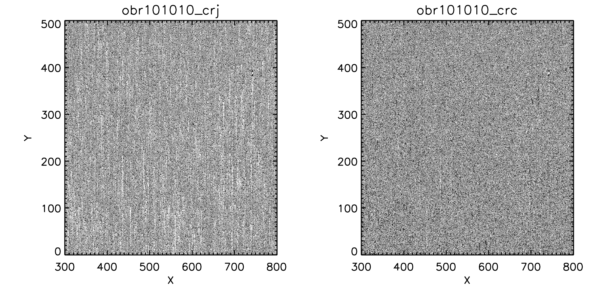

========================================
STIS Pixel-Based CTI-Correction Tutorial
========================================
Please note that AURA/STScI is not responsible for any damage resulting from the use of 
this software.

Please send any feedback to the STIS team at help@stsci.edu.

**Update:**  See the `Known Issues`_ section.

Introduction
============
The ``stis_cti`` package implements the Anderson & Bedin (`PASP 2010, 122: 1035-1064 
<http://adsabs.harvard.edu//abs/2010PASP..122.1035A>`_) pixel-based Charge Transfer 
Inefficiency (CTI)-correction on HST/STIS CCD data.  It performs bias corrections on the 
data, calls ``StisPixCteCorr()`` on the intermediate products, and finishes running the 
remaining ``CalSTIS`` processing steps.

The code also creates CTI-corrected super-dark reference files to use in this processing 
from component dark files.  When run, the user will be prompted to retrieve these 
component darks from the MAST archive if they have not already been retrieved.  The code 
makes use of the ``refstis`` package to generate super-darks from the component darks.

Note that not all observing modes are currently supported.  The code will not reprocess 
data taken in subarray or binned modes, with a non-D amplifier, in ACQ mode, or from 
before the STIS recovery of May 2009.

System Requirements
===================
This package is designed to run on top of the AstroConda channel (with legacy IRAF support) 
of the Anaconda Python environment on the UNIX/Linux and MacOS X operating systems.  It 
currently supports Python 2.7.

AstroConda is available at http://astroconda.readthedocs.io.

Installation
============
First, launch the AstroConda (with legacy IRAF support) environment:

::
   
   source activate astroconda

Then, install the required packages within the AstroConda environment:

::
   
   pip install stis_cti

Or, to upgrade from a previous installation:

::
  
  pip install --upgrade --no-deps stis_cti
  pip install stis_cti
  pip install --upgrade --no-deps refstis
  pip install refstis

To optionally install a local CRDS cache in a common location on your system, please see:

https://hst-crds.stsci.edu/docs/cmdline_bestrefs/

To do this, you will need to define the environmental variables ``$CRDS_SERVER_URL``, 
``$CRDS_PATH``, and ``$oref`` appropriately.

Directory Structure
===================
To run the correction, you will need directories to hold dark files, pipeline reference 
files, reference files generated by the script, and science data.  Many of these 
directories may be shared between projects, thus reducing redundant computations.

Here's one possible layout:

* base_dir/  
   - science/ — contains at least the pipeline's "uncalibrated" products that are to be corrected  
   - darks/ — component darks (``_flt.fits``); their CTI-corrected counterparts (``_cte.fits``) will be placed in here  
   - ref/ — location for CTI-corrected super-darks produced by the ``stis_cti`` script  
   - oref/ — pipeline reference files (specifying the ``--crds_update`` option creates this directory at ``ref/references/hst/oref/``)

For example::

  mkdir stis_cti_corrected
  mkdir stis_cti_corrected/my_science
  mkdir stis_cti_corrected/darks
  mkdir stis_cti_corrected/ref

By default, the command-line interface assumes that there are ``ref/`` and ``darks/`` 
directories parallel to the ``science/`` directory (of any name), though alternate 
configurations may be specified.

Output files in the ``science/`` directory from a previous run of ``stis_cti`` will need 
to be deleted or moved, unless the ``--clean`` option is specified.  Applicable corrected 
super-darks and darks may be reused for other science data by specifying the appropriate 
``darks/`` and ``ref/`` directories.

Specifying ``--clean_all`` will force the script to recreate super-darks and re-run the 
CTI-correction on all needed component darks.

If the ``--crds_update`` option is not selected, then the ``$oref`` shell variable must 
be set before launching the script (including the trailing ``'/'``).  In Bash::

  export oref="/path/to/oref/"

This directory must contain the needed reference files specified in the science and 
component dark headers, as is typical for running ``CalSTIS``.

Command-line Usage
==================
The easiest way to invoke the correction is from the ``UNIX`` shell.

Note that running this script requires an internet connection to the MAST archive site.
The Archive status may be checked at http://archive.stsci.edu/help/archive_status.html.

::

  source activate astroconda
  stis_cti --help

::

  usage: stis_cti [-h] [-d DARK_DIR] [-r REF_DIR] [-n NUM_PROCESSES]
                  [-p PCTETAB] [--crds_update] [--clean] [--clean_all]
                  [--ignore_missing] [-v VERBOSE_LEVEL]
                  [SCIENCE_DIR]
  
  Run STIS/CCD pixel-based CTI-correction on data specified in SCIENCE_DIR.
  Uncorrected component darks are read from DARK_DIR, and corrected component
  darks are written there too. Corrected super-darks are read from and stored to
  REF_DIR. See documentation at http://pythonhosted.org/stis_cti/
  
  positional arguments:
    SCIENCE_DIR       directory containing RAW science data (default="./")
  
  optional arguments:
    -h, --help        show this help message and exit
    -d DARK_DIR       directory of dark FLT data
                      (default="[SCIENCE_DIR]/../darks/")
    -r REF_DIR        directory of CTI-corrected reference files
                      (default="[SCIENCE_DIR]/../ref/")
    -n NUM_PROCESSES  maximum number of parallel processes to run (default=15);
                      number of available CPU cores on your system = 40
    -p PCTETAB        name of PCTETAB to use in pixel-based correction
                      (default="[REF_DIR]/[MOST_RECENT]_pcte.fits" or package's
                      default PCTETAB)
    --crds_update     update and download $oref files
    --clean           remove intermediate and final products from previous runs
                      of this script ('*.txt' files are skipped and clobbered)
    --clean_all       '--clean' + remove previous super-darks and CTI-corrected
                      component darks
    --ignore_missing  process data even with an incomplete set of dark FLTs
    -v VERBOSE_LEVEL  verbosity ({0,1,2}; default=1)
  
  Author: Sean Lockwood; Version: 1.1

The script is designed to run the pixel-based correction in parallel on the component 
darks, and in parallel on the science files.  The maximum number of processes may be 
specified via the ``-n #`` option.

A typical call looks like::

  stis_cti -v 2 -n 15 --crds_update my_science_dir/

(Assuming that there are ``ref/`` and ``darks/`` directories parallel to 
``my_science_dir/``.)

.. Warning::
   
   For recent STIS observations (new data taken in last 30 to 60 days) optimal dark 
   reference files will not yet be available.  This will affect the selection of data 
   being used to generate the CTI-corrected super-darks.  To get the most accurate 
   calibration, please re-reduce your data after the pipeline's new super-biases and 
   super-darks have been delivered by deleting the relevant old CTI-corrected super-darks 
   in the ``ref/`` directory and running ``stis_cti`` with the ``--clean`` and 
   ``--crds_update`` options specified.  You may need to download additional component 
   darks from MAST.
   
   To receive updates when STIS reference files are delivered to CRDS, go to 
   https://maillist.stsci.edu and subscribe to the ``stis_reffiles_upd`` mailing list.
   
   You can also check the status of super-dark and super-bias files by going to 
   https://hst-crds.stsci.edu and clicking on STIS-->darkfile and STIS-->biasfile.  Sort 
   by USEAFTER to see if the week corresponding to your science data has been delivered 
   yet.

----------------------------------------------------------------------------------------

While ``stis_cti`` will tell you what component darks are needed, you can also determine 
this ahead of time:

.. parsed-literal::
  
  archive_dark_query data/\*_raw.fits
  
  Querying MAST archive for dark and anneal program IDs...
  Querying MAST archive for darks...
  Parsing archive results...
  
  Download darks via this link:
  
  http://archive.stsci.edu/hst/search.php?sci_instrume=STIS&sci_instrument_config=STIS%2FCCD&sci_targname=DARK&sci_aec=C&resolve=don%27tresolve&sci_data_set_name=OC4W6XH3Q%2COC4W6YHBQ%2COC4W6ZP2Q%2COC4W70PCQ%2COC4W71TEQ%2COC4W72TOQ%2COC4W73X8Q%2COC4W74XJQ%2COC4W75D0Q%2COC4W76DCQ%2COC4W77HHQ%2COC4W78I0Q%2COC4W79A5Q%2COC4W7AADQ%2COC4W7BFGQ%2COC4W7CF9Q%2COC4W7DJNQ%2COC4W7EJRQ%2COC4W7FOAQ%2COC4W7GO4Q%2COC4W7HSNQ%2COC4W7ISUQ%2COC4W7JXEQ%2COC4W7KXAQ%2COC4W7LGRQ%2COC4W7MGWQ%2COC4W7NA1Q%2COC4W7OA8Q%2COC4W7PM6Q%2COC4W7QMDQ%2COC4W7RTJQ%2COC4W7STNQ%2COC4W7TX4Q%2COC4W7UXDQ%2COC4W7VIKQ%2COC4W7WIRQ%2COC4W7XNJQ%2COC4W7YNRQ%2COC4W7ZSZQ%2COC4W80TMQ%2COC4W81A4Q%2COC4W82AGQ%2COC4W83NMQ%2COC4W84O1Q%2COC4W85SRQ%2COC4W86SZQ%2COC4W87XWQ%2COC4W88YHQ%2COC4W89D6Q%2COC4W8ADJQ%2COC4W8BHWQ%2COC4W8CI2Q%2COC4W8DNUQ%2COC4W8EOAQ%2COC4W8FBPQ%2COC4W8GBTQ&max_records=50000&max_rpp=5000&ordercolumn1=sci_start_time&action=Search

Place these darks in the ``DARK_DIR`` directory.

Alternatively, a list of the component darks comprising each annealing period is maintained
at http://www.stsci.edu/~STIS/monitors/anneals/anneal_periods.html.  Note that it does
not list the most recent annealing period until it is complete.

Python Usage
============
If you wish to run the ``stis_cti`` script from within Python (say from within another 
script), it may be called via:

.. code:: python
  
  import stis_cti
  
  # Explicit directories must be specified when run through the Python interface.
  stis_cti.stis_cti('science_dir/', 'dark_dir/', 'ref_dir/', 5, verbose=True)
      # where 5 is num_processes

Note that there are other options available via the Python interface, but these have not 
yet been fully vetted.

Output Products
===============
The following data products are output by ``stis_cti``:

+----------------------------------+------------------+-----------------------+
| **Product**                      | **Original Ext** | **CTI-Corrected Ext** |
+==================================+==================+=======================+
| Bias- and CTI-corrected science  | n/a              | CTE [#cte]_           |
| (intermediate product)           |                  |                       |
+----------------------------------+------------------+-----------------------+
| Cosmic ray rejected, flat-       | CRJ              | CRC                   |
| fielded science                  |                  |                       |
+----------------------------------+------------------+-----------------------+
| Flat-fielded science             | FLT              | FLC                   |
+----------------------------------+------------------+-----------------------+
| 1-D extracted spectra for        | X1D              | X1C                   |
| individual imsets:               |                  |                       |
|                                  |                  |                       |
| * Aperture extracted, background |                  |                       |
|   subtracted, flux and           |                  |                       |
|   wavelength calibrated spectra  |                  |                       |
+----------------------------------+------------------+-----------------------+
| 2-D spectral and direct images   | X2D              | X2C                   |
| for individual imsets:           |                  |                       |
|                                  |                  |                       |
| * Rectified, wavelength and      |                  |                       |
|   flux calibrated first order    |                  |                       |
|   spectra or                     |                  |                       |
| * Geometrically corrected        |                  |                       |
|   imaging data.                  |                  |                       |
+----------------------------------+------------------+-----------------------+
| 1-D extracted spectra from       | SX2              | S2C                   |
| from summed (REPEATOBS) or       |                  |                       |
| cosmic ray rejected (CRSPLIT)    |                  |                       |
| images.                          |                  |                       |
+----------------------------------+------------------+-----------------------+
| 2-D rectified direct or spectral | SX1              | S1C                   |
| images from summed (REPEATOBS)   |                  |                       |
| or cosmic ray rejected (CRSPLIT) |                  |                       |
| images.                          |                  |                       |
+----------------------------------+------------------+-----------------------+

.. [#cte] Where ``CTE`` files are bias- and CTI-corrected intermediate products.

   
   A comparison of part of a STIS cosmic-ray rejected image.  Note the CTI trails are 
   removed in both the science and super-dark data used to generate the ``_crc`` file.

Advanced Topics
===============

Custom Super-Darks
------------------
For detailed text on how to create and apply a custom super-dark on your system, run:

.. code:: python
  
  import stis_cti
  stis_cti.custom_superdark_info()

The ``stis_cti`` script first determines if the ``DARKFILE`` specified in each science 
file's header is already CTI-corrected (assuming it exists) by checking that the ``ext=0``
header keyword ``PCTECORR=='COMPLETE'``.  If it is, then the script will not attempt to 
replace it.  This allows users the flexibility to create their own super-darks via the 
``refstis`` package with their own parameters and/or input data (e.g. 
herringbone-corrected_ data files).

.. _herringbone-corrected: http://stis2.sese.asu.edu/

The ``stis_cti`` package will ordinarily create a CTI-corrected super-dark automatically, 
assuming updated super-dark files have been applied to pipeline data (this is typically 
done in the months following an observation).  To create your own super-dark from 
component darks of your own choosing, you may follow the procedure outlined below.

.. code:: python
  
  import refstis
  import glob
  from astropy.io import fits
  
  # First, populate the _flt.fits dark file headers with the PCTETAB reference file 
  # location and name.
  
  # Then, run stis_cti.StisPixCteCorr.CteCorr() on the _flt.fits dark files to produce 
  # CTI-corrected _cte.fits dark files.
  
  # Make the monthly basedark, which is used in making the weekdark:
  # (Assuming only the annealing month's darks are selected below.)
  month_files = glob.glob('annealing_month/*_cte.fits')
  refstis.basedark.make_basedark(month_files, refdark_name='basedark_drk.fits')
  # (This produces basedark_drk.fits, which is used as an input below.)
  
  # Make the weekdark, which is applied to the science data:
  # (Assuming we have moved the appropriate _cte files for the week to my_week/)
  week_files = glob.glob('my_week/*_cte.fits')
  refstis.weekdark.make_weekdark(week_files, refdark_name='weekdark_drk.fits',
      thebasedark='basedark_drk.fits')
  # (This produces weekdark_drk.fits, which will be used in calibrating our science data.)
  
  # You must mark the new weekdark(s) as being CTI-corrected:
  fits.setval('weekdark_drk.fits', 'PCTECORR', value='COMPLETE')
  
  # Point the science files at the new weekdark:
  # Define $stisref to point to the directory containing the weekdark in the (Bash) shell.
  #   export stisref='/path/to/my_dir/'
  # 
  # Then, on each science file:
  fits.setval('science/filename_raw.fits', 'DARKFILE', value='stisref$weekdark_drk.fits')

Now when ``stis_cti`` is run on the science directory, it won't try to recreate the 
super-dark, but will still CTI-correct the science images and apply the new super-dark.

Be sure not to run ``stis_cti`` with the ``--crds_update`` option, as this will override 
the custom super-dark specified above.

CRDS Updates
------------
Oftentimes, the reference files specified in a dataset get replaced within the pipeline.  
This is especially true of super-biases and super-darks produced in the months following 
the execution of an observation.  When new reference files are available, you may 
re-retrieve the data from MAST.  Alternatively, the CRDS ``bestrefs`` script now supports 
updating header keywords and downloading required reference files automatically.

When run with the ``--crds_update`` option, the script will update header keywords and 
download reference files to the ``$oref`` directory nested properly within the 
``$CRDS_PATH`` directory, if it is writable.  If this is not set up, one will be created 
within the ``ref/`` directory.

Note that this option is not currently compatible with specifying one's own super-dark, as 
the user-specified ``DARKFILE`` keyword will be over-written.  As a workaround, you may 
run the CRDS bestref script manually and then override the ``DARKFILE`` keyword as 
desired.

To run CRDS bestref manually, see https://hst-crds.stsci.edu/docs/cmdline_bestrefs/ or 
re-retrieve your data and best reference files from MAST.  You may also wish to setup a 
common local CRDS cache of reference files to avoid redundancy and save disk space.

PCTETAB Updates
---------------
The ``stis_cti`` package includes the ``v0.1`` ``PCTETAB`` reference file, which 
specifies the parameters necessary to run the pixel-based correction on STIS data.  If 
this file is updated, or if an advanced user wishes to modify the file to run the 
correction differently, the new version may be placed in the ``ref/`` directory.  (If 
multiple ``PCTETAB`` files are present, the one with the last alphabetical name will be 
used.)

The location of the current package ``PCTETAB`` can be found by running 
``stis_cti.custom_superdark_info()`` or checking log files.

To completely re-run the CTI-correction, you can delete any needed basedarks/weekdarks in 
the ``ref/`` directory and any needed ``_cte.fits`` files in the ``darks/`` directory by 
specifying the ``--clean_all`` option.

Known Issues
============

.. Warning::
   If you use ``stistools.x1d.x1d()`` to manually extract your spectra, we recommend using 
   the argument ``ctecorr="OMIT"`` for pixel-based CTI-corrected data.

- The ``--crds_update`` option breaks with ``CRDS v7.0.10``.  Until this is fixed, users 
  may manually downgrade to the earlier ``CRDS v7.0.7`` package with the command:
  
  ``conda install crds=7.0.7``

- Some annealing months contain non-standard amplifier=A dark files (typical 
  observations are taken with amp=D).  These files do not produce ``FLT`` files in the
  Archive, but are still expected by ``stis_cti`` (even though they are excluded from any 
  amp=D super-darks).  As of ``v1.1``, users may bypass the missing file check by specifying 
  the ``--ignore_missing`` flag.  Care should be taken that only intended dark files are
  excluded.

- The primary FITS header keyword ``FILENAME`` does not get updated in CTI-corrected 
  output products.

- Running ``stistools.x1d.x1d()`` -- A tool to manually extract 1D spectra from ``FLT`` / 
  ``FLC`` files:

  - The older empirical CTI flux correction is incorrectly run by default, even if the 
    FITS primary header keyword is set to ``CTECORR`` = ``OMIT``.
    
    To properly run ``stistools.x1d.x1d()`` on ``FLC`` files, specify ``ctecorr="OMIT"``
    in the ``stistools.x1d.x1d()`` argument list.
    
  - The output product names when running ``stistools.x1d.x1d()`` do not match those 
    output by ``stis_cti``:
    
    +---------------+---------------------+--------------------+----------------------+
    | CR-Corrected? | Standard Products   | Output of stis_cti | Output of x1d() from |
    |               | (Non-CTI-Corrected) |                    | stis_cti 2D product  |
    +===============+=====================+====================+======================+
    | No            | ``_x1d.fits``       | ``_x1c.fits``      | ``_flc_x1d.fits``    |
    +---------------+---------------------+--------------------+----------------------+
    | Yes           | ``_sx1.fits``       | ``_s1c.fits``      | ``_crc_x1d.fits``    |
    +---------------+---------------------+--------------------+----------------------+
